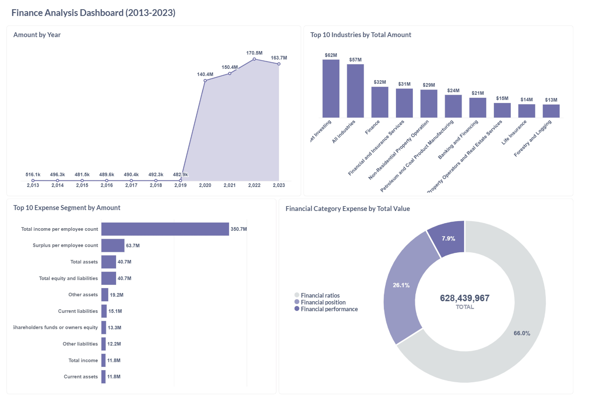

# Modern Containerized ELT Pipeline

## Introduction
Data engineers and analysts constantly face almost similar problems which is reliably getting external data into a database, cleaning, modelling it and making it available to stakeholders  while at the same time keeping the setup reproducible and easy to deploy.
This project is a practical, end-to-end implementation of that flow using dockerized components:

The components are: 
* Python extractor (containerized, scheduled with cron)
* PostgreSQL database
* dbt for transformations
* Metabase for visualization
* pgAdmin for database inspection
* CI-friendly deploy script and Docker Hub images for reproducibility

## Problem Statement
Teams need pipelines that are:
* Reproducible — anyone should be able to run the stack without building local images.
* Automated — daily ingestion without manual steps (cron inside container).
* Testable — ability to inspect staging schema, iterate on transforms, and run dbt tests.
* Visible — easy dashboards for non-technical stakeholders and a DB admin view.
* Portable — works on Windows, macOS, Linux via Docker Compose; images pushed to Docker Hub.
This project solves those problems by combining lightweight, well-known tools into a single, documented repository you can clone and run in minutes.

## Why these tools? (Tools & Technologies)
* **Docker / Docker Compose** — Containerization ensures everyone runs the same environment. Compose orchestrates multi-container stacks locally without Kubernetes complexity.
* **PostgreSQL** — A mature, reliable open-source relational database for staging and analytics.
* **Python (pandas + sqlalchemy)** — Python is ideal for data extraction and the initial load. pandas for parsing the CSV and sqlalchemy for straightforward writes to Postgres.
* **cron (inside container)** — Instead of relying on host OS schedulers (which vary by OS), the cron scheduler is placed inside the extractor container, so scheduling is reproducible across platforms (especially on Windows).
* **dbt** — dbt (data build tool) provides repeatable, testable SQL-based transformations and standard best practices for modeling.
* **Metabase** — Friendly, self-hostable BI tool to let analysts and stakeholders create charts and dashboards with minimal effort.
* **pgAdmin** — A GUI to inspect the database, run ad-hoc SQL, and check table contents during development.
* **Docker Hub** — Storing images on Docker Hub means other users can docker pull and run your pipeline without building images locally.

## Architecture
Below is the architectural diagram for this project


## Project Layout
```
|-- README.md
|-- dbt
|   |-- dbt_project.yml
|   |-- models
|   |   `-- transform.sql
|   `-- profiles.yml
|-- deploy.sh
|-- docker-compose.yml
|-- etl_docker_compose.drawio.svg
|--MetabaseFinance.jpg
|-- extract
|   |-- Dockerfile
|   |-- data
|   |-- extract.py
|   `-- requirements.txt
|-- metabase-data
`-- pgadmin

## How to Use the Project
* **Clone the repository**
```bash
git clone https://github.com/Blessing-DE/ELT_pipeline_with_python_dbt_docker.git
cd elt_python_dbt_docker
```
* **Create your .env file**
#### Configure your database
```
POSTGRES_USER=your_username
POSTGRES_PASSWORD=your_user_password
POSTGRES_DB=your_database_name
PG_HOST=your_host(likely postgres)
PG_PORT=pg_port
```
#### Extractor
CSV_URL=the_url
DOWNLOAD_DIR=/app/data

#### PgAdmin credentials
PGADMIN_DEFAULT_EMAIL=pg_admin_email
PGADMIN_DEFAULT_PASSWORD=pg_admin_password

#### Metabase
MB_DB_FILE=/metabase.db

* **Run the deployment script**
This command builds the extractor image, pushes it to Docker Hub, and brings up all services.
```bash
chmod +x deploy.sh
./deploy.sh
```

* **Run the extractor manually (optional)**

* To trigger data ingestion immediately:
```bash
docker exec -it elt_extractor sh -c "python /app/extract.py"
```

* **Transform data with dbt**
```bash
docker exec -it elt_dbt bash -lc "dbt debug && dbt run && dbt test"
```
This command will:
* Validate DB connections
* Execute all SQL models (In our case *transform.sql*)
* Run dbt tests

* **Explore and visualize data**
* pgAdmin — http://localhost:8080
* *N/B: Login with credentials from .env*.

Login to Metabase for visualization using this port and the database credentials 
* **Metabase — http://localhost:3000**
* Set up your Metabase admin account.
* Add PostgreSQL as a data source with the same credentials.
* Create dashboards and explore your models.

Below is the visualization of the dataset using Metabase


### Shut down or reset the entire flow
* To stop containers and remove the associated database volume:
```bash
docker compose down -v
```
* **To redeploy afresh:**
```bash
./deploy.sh
```

## Key Features of this Project
* Automated daily extraction using cron
* Seamless loading into PostgreSQL
* dbt-based SQL transformations
* Interactive BI with Metabase
* Inspectable via pgAdmin
* Fully containerized and reproducible
* Single-command deployment (./deploy.sh)

## Testing & Validation
While working on this projects, a few test and validation are recommended and below are some of them
* **Test 1: Data Load Verification**
* Run extractor once manually.
* Check that staging_enterprise table is created and populated.
* **Test 2: dbt Model Validation**
* Run dbt run and confirm analytics tables exist.
* Run dbt test to ensure constraints pass.
* **Test 3: Visualization**
* Connect Metabase → Create chart → format & re-validate the values on the dashboard.

## Scalability Considerations
* Add Airflow or any other preferred orchestration tool for advanced orchestration.
* Move data from CSV → S3 → RDB for large-scale use (utilize cloud service provider for this).
* Add logging and monitoring.


## Conclusion
This project represents a complete, containerized ELT workflow, from raw data ingestion to dashboard visualization. It demonstrates modern data engineering practices: automation, reproducibility, modularity, and observability.

By integrating Python, PostgreSQL, dbt, and Metabase within Dockerized environments, the project eliminates local dependency issues and delivers a standardized, production-ready data pipeline.
    